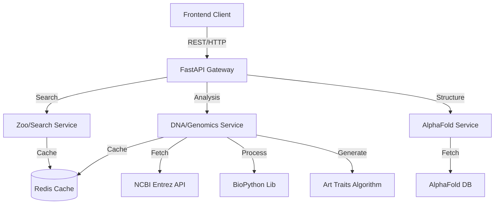

# 🧬 GeneticFrames - Architecture & Roadmap Report

## 1. 🏗️ Arquitectura General

GeneticFrames opera bajo una arquitectura de **Microservicio Híbrido** orientada al procesamiento científico y la visualización artística.

### Diagrama Lógico

### Componentes Clave
1.  **FastAPI Gateway**: Punto de entrada asíncrono que maneja validación (Pydantic), rate limiting y routing.
2.  **DNA Service ("The Artist")**: Núcleo del sistema. No solo obtiene datos biológicos, sino que ejecuta el algoritmo de transformación `Genetics -> Art Parameters`.
3.  **Zoo Service ("The Curator")**: Organiza la data biológica en estructuras consumibles por humanos ("Exhibits", "Zones").
4.  **AlphaFold Integration**: Puente hacia la base de datos de estructuras proteicas de DeepMind.

---

## 2. 💡 Mejoras Implementadas (Creative Freedom)

Para transformar la herramienta en un "Zoológico de Arte Digital", se implementaron:

1.  **Algoritmo "Genomic Signature"**:
    *   Hashing determinístico de la secuencia para garantizar que *mismo ADN = misma identidad visual*.
    *   Mapeo de `GC Content` a paletas de colores (Cálido vs Frío).
    *   Mapeo de entropía a complejidad geométrica.

2.  **Simulador de Evolución**:
    *   Endpoint `/mutate` y parámetro `mutation_rate`.
    *   Permite al usuario ver cómo pequeños cambios genéticos alteran la obra de arte resultante.

3.  **Arquitectura de Exhibiciones**:
    *   Nuevo endpoint `/exhibits` que agrupa especies temáticamente (e.g., "Deep Sea Giants", "Apex Predators"), mejorando la UX de exploración.

---

## 3. 🗺️ Roadmap Técnico

### Fase 1: Hardening
- [ ] **Tests Unitarios Reales**: Reemplazar mocks en `test_dna.py` con tests que usen VCR.py para grabar respuestas de NCBI.
- [ ] **Redis Persistencia**: Configurar Redis para no perder caché en reinicios.
- [ ] **Error Handling Granular**: Diferenciar errores de "Especie no encontrada" vs "Error de conexión NCBI".

### Fase 2: Performance & Scaling
- [ ] **Celery Workers**: Mover el procesamiento pesado (Análisis de ADN > 10kb) a una cola de tareas Celery.
- [ ] **Streaming Responses**: Para la generación de arte 3D, enviar datos progresivamente al frontend.
- [ ] **CDN para Assets**: Servir los archivos PDB/CIF de AlphaFold a través de un proxy/CDN propio para evitar rate limits externos.

### Fase 3: The "Zoo" Experience
- [ ] **User Accounts (Supabase)**: Guardar "Colecciones" de especies favoritas.
- [ ] **Community Mutations**: Permitir a usuarios guardar sus versiones "mutadas" y compartirlas.
- [ ] **Integration Tests**: Pruebas E2E completas desde la búsqueda hasta la generación.

### Fase 4: Launch Preparation
- [ ] Despliegue en **Render** (Backend).
- [ ] Despliegue en **Vercel** (Frontend).
- [ ] Configuración de monitoreo (Sentry + Prometheus).

## 🚀 Guía de Despliegue en Render

Se ha incluido un archivo `render.yaml` para automatizar el despliegue.

1.  Crear cuenta en [Render.com](https://render.com).
2.  Ir a **Blueprints** > **New Blueprint Instance**.
3.  Conectar este repositorio.
4.  Render detectará automáticamente:
    *   **API Service**: FastAPI corriendo en Python.
    *   **Redis Service**: Instancia para caché.
5.  Aprobar el despliegue.

*Nota: Una vez desplegado, copia la URL del backend (e.g., `https://geneticframes-api.onrender.com`) y actualiza la variable `VITE_API_URL` en el frontend.*

---

## 4. Conclusión

GeneticFrames está listo como MVP avanzado. La arquitectura es modular y soporta la expansión creativa. La inclusión de la lógica de "Arte Genético" en el backend asegura consistencia en cualquier cliente (Web, Mobile, VR).
