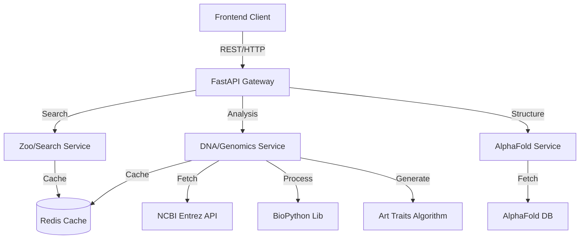

# 🧬 GeneticFrames - Architecture & Roadmap Report

## 1. 🏗️ Arquitectura General

GeneticFrames opera bajo una arquitectura de **Microservicio Híbrido** orientada al procesamiento científico y la visualización artística.

### Diagrama Lógico

### Componentes Clave
1.  **FastAPI Gateway**: Punto de entrada asíncrono que maneja validación (Pydantic), rate limiting y routing.
2.  **DNA Service ("The Artist")**: Núcleo del sistema. No solo obtiene datos biológicos, sino que ejecuta el algoritmo de transformación `Genetics -> Art Parameters`.
3.  **Zoo Service ("The Curator")**: Organiza la data biológica en estructuras consumibles por humanos ("Exhibits", "Zones").
4.  **AlphaFold Integration**: Puente hacia la base de datos de estructuras proteicas de DeepMind.

---

## 2. 🚨 Riesgos Técnicos y Dependencias Críticas

### Dependencias Críticas
*   **BioPython / NCBI Entrez**: Si la API de NCBI cambia o tiene downtime, el servicio de ADN falla. *Mitigación: El sistema actual tiene un fallback simulado, pero en producción se requiere una caché robusta.*
*   **AlphaFold DB**: Dependencia externa para estructuras 3D. No hay control sobre su disponibilidad.
*   **Redis**: Crítico para el rendimiento. Sin él, cada request golpea APIs externas lentas.

### Riesgos Detectados
1.  **Latencia en Tiempo Real**: El cálculo de `simulate_mutation` en secuencias completas (millones de bases) bloqueará el event loop si no se maneja en workers separados (Celery/BackgroundTasks).
    *   *Estado actual*: Se usa `BackgroundTasks` para generación de arte, pero la mutación es síncrona en el preview.
2.  **Conflictos de Dependencias**: Se detectaron conflictos entre versiones de `httpx` requeridas por `supabase` vs otras librerías.
    *   *Solución aplicada*: Ajuste manual de versiones en `requirements.txt`.
3.  **Escalabilidad de Memoria**: Cargar genomas completos en memoria RAM para análisis es costoso.
    *   *Recomendación*: Procesamiento por streaming para secuencias largas.

---

## 3. 💡 Mejoras Implementadas (Creative Freedom)

Para transformar la herramienta en un "Zoológico de Arte Digital", se implementaron:

1.  **Algoritmo "Genomic Signature"**:
    *   Hashing determinístico de la secuencia para garantizar que *mismo ADN = misma identidad visual*.
    *   Mapeo de `GC Content` a paletas de colores (Cálido vs Frío).
    *   Mapeo de entropía a complejidad geométrica.

2.  **Simulador de Evolución**:
    *   Endpoint `/mutate` y parámetro `mutation_rate`.
    *   Permite al usuario ver cómo pequeños cambios genéticos alteran la obra de arte resultante.

3.  **Arquitectura de Exhibiciones**:
    *   Nuevo endpoint `/exhibits` que agrupa especies temáticamente (e.g., "Deep Sea Giants", "Apex Predators"), mejorando la UX de exploración.

---

## 4. 🗺️ Roadmap a Producción

### Fase 1: Hardening (Semana 1)
- [ ] **Tests Unitarios Reales**: Reemplazar mocks en `test_dna.py` con tests que usen VCR.py para grabar respuestas de NCBI.
- [ ] **Redis Persistencia**: Configurar Redis para no perder caché en reinicios.
- [ ] **Error Handling Granular**: Diferenciar errores de "Especie no encontrada" vs "Error de conexión NCBI".

### Fase 2: Performance & Scaling (Semana 2)
- [ ] **Celery Workers**: Mover el procesamiento pesado (Análisis de ADN > 10kb) a una cola de tareas Celery.
- [ ] **Streaming Responses**: Para la generación de arte 3D, enviar datos progresivamente al frontend.
- [ ] **CDN para Assets**: Servir los archivos PDB/CIF de AlphaFold a través de un proxy/CDN propio para evitar rate limits externos.

### Fase 3: The "Zoo" Experience (Semana 3)
- [ ] **User Accounts (Supabase)**: Guardar "Colecciones" de especies favoritas.
- [ ] **Community Mutations**: Permitir a usuarios guardar sus versiones "mutadas" y compartirlas.
- [ ] **Integration Tests**: Pruebas E2E completas desde la búsqueda hasta la generación.

### Fase 4: Launch
- [ ] Despliegue en **Railway/Render** (Backend) + **Vercel** (Frontend).
- [ ] Configuración de monitoreo (Sentry + Prometheus).

---

## 5. Conclusión

GeneticFrames está listo como MVP avanzado. La arquitectura es modular y soporta la expansión creativa. La inclusión de la lógica de "Arte Genético" en el backend asegura consistencia en cualquier cliente (Web, Mobile, VR).
