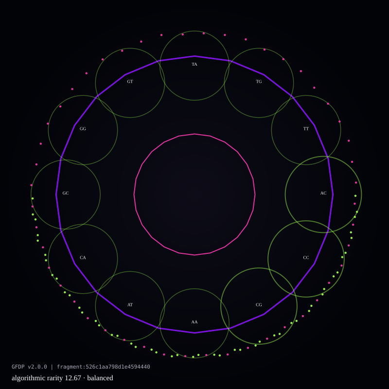
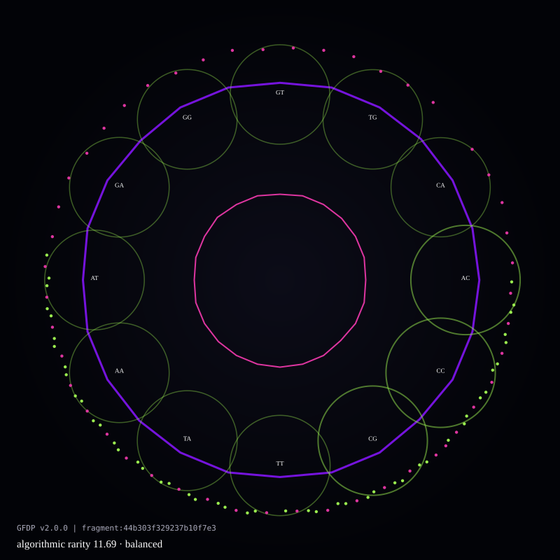
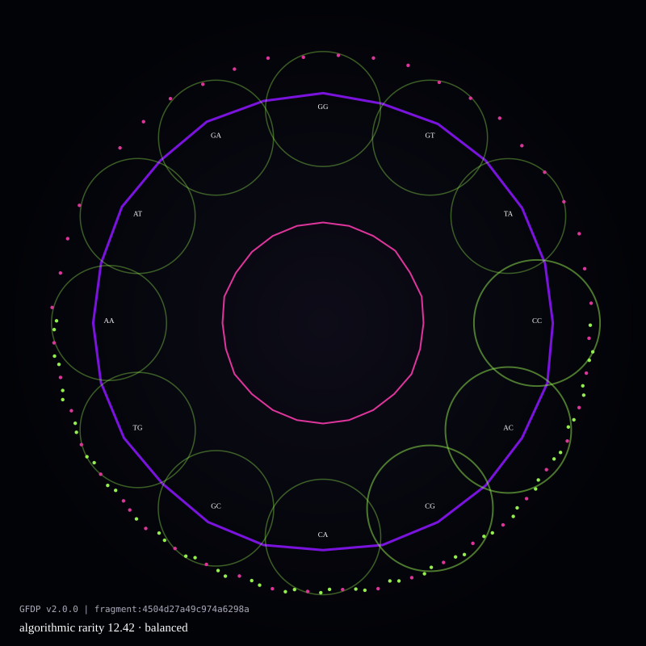
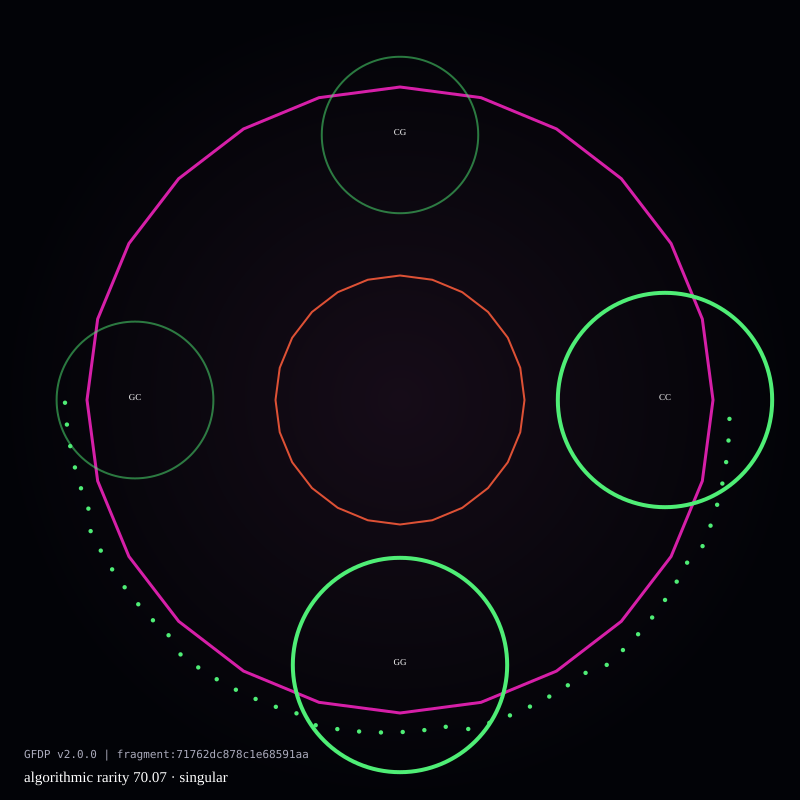
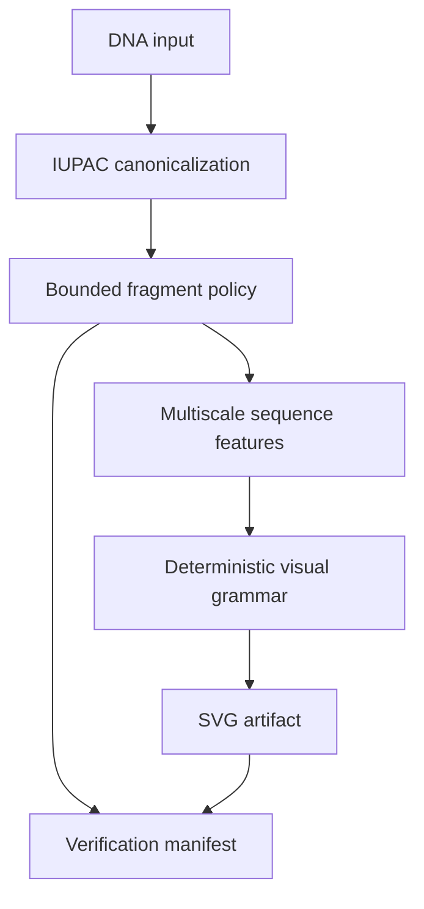

<div align="center">

# GeneticFrames

### Verifiable DNA-to-SVG art

**The same DNA fragment + the same algorithm version always produces the same image.**

[Protocol](#how-gfdp-works) · [Visual family](#visual-family) · [Verify](#offline-verification) · [Limits](#scientific-boundaries)

</div>

GeneticFrames is an experimental protocol for turning short DNA fragments into
compact, deterministic vector art. Its core, **GFDP v2**, maps measurable sequence
features directly to color, geometry and fine detail, then emits an SVG and a
machine-verifiable manifest.

The blockchain is not asked to prove that an image is pretty or that a species is
rare. It certifies a precise claim:

> This SVG is the reproducible output of this canonical DNA fragment under this
> published algorithm version.

## Visual family

The following four SVGs were generated by `examples/generate_readme_assets.py`.
They are committed artifacts, not mockups. The first three fragments are closely
related fixtures; the fourth has a deliberately distant compositional profile.
These fixtures demonstrate behavior and make **no biological species claim**.

| Reference | Close variant A |
|---|---|
|  |  |
| distance `0.000000` · `10,568 B` | distance `0.000802` · `10,566 B` |

| Close variant B | Distant profile |
|---|---|
|  |  |
| distance `0.000565` · `10,567 B` | distance `0.668130` · `5,572 B` |

The related fixtures preserve their overall visual family while mutations change
local geometry and motif details. The distant composition produces a substantially
different structure. Exact hashes and sizes are recorded in
[`docs/images/samples.json`](docs/images/samples.json).

## Guarantees

| Requirement | GFDP v2 behavior |
|---|---|
| Reproducibility | Canonical input and version produce byte-identical SVG output |
| Sequence-derived uniqueness | Geometry uses local composition, k-mers and actual motif positions; no random layout |
| Family resemblance | Continuous GC, entropy, skew and multi-k-mer mappings avoid arbitrary species presets |
| Short-fragment scalability | Renders 64–1,024 unambiguous bases; default is 768 |
| Encoded rarity | Reports **algorithmic composition rarity**, never unproven biological rarity |
| Storage efficiency | SVG output has a hard 64 KB budget; current examples are 5.5–10.6 KB |
| Independent verification | Hashes the complete input, fragment, manifest and exact SVG bytes |

## How GFDP works



### 1. Canonicalization

- Whitespace is removed.
- Symbols are converted to uppercase.
- RNA `U` is normalized to DNA `T`.
- Only IUPAC DNA symbols are accepted.
- Invalid symbols fail explicitly.

### 2. Bounded fragment selection

GFDP never attempts to render a whole genome. A versioned policy selects a short
fragment:

- default: centered 768 bases;
- supported: 64–1,024 unambiguous bases;
- available modes: `center`, `prefix`, `suffix`.

The complete supplied sequence may still be hashed for provenance, while only the
selected fragment affects the image.

### 3. Sequence-derived visual grammar

| Sequence evidence | Visual role |
|---|---|
| GC content, AT/GC skew, entropy | Continuous color family |
| Local composition windows | Primary outer and inner geometry |
| Dinucleotide frequency ranking | Secondary circles and weights |
| Real `CG` and `AT` positions | Fine nodes visible at high zoom |
| Fragment hash | Certificate identity, not decorative randomness |

There is no taxonomic lookup table that assigns “lion colors” or “dolphin shapes.”
Relatedness emerges from similarity in their fragments. For rigorous biological
comparison, fragments must be homologous and selected under the same protocol.

### 4. Manifest and identity

Every generation returns the SVG plus a JSON-compatible manifest containing:

```json
{
  "algorithm": {
    "id": "geneticframes-dna-svg",
    "version": "2.0.0"
  },
  "sequence": { "sha256": "…", "length": 768 },
  "fragment": {
    "sha256": "…",
    "offset_zero_based": 0,
    "length": 768,
    "policy": { "mode": "center", "requested_length": 768 }
  },
  "rarity": {
    "metric": "algorithmic_composition_rarity",
    "score": 12.34,
    "scientific_population_rarity": false
  },
  "svg_sha256": "…",
  "svg_bytes": 10568
}
```

Human-readable species labels and source metadata live in the manifest and do not
change the certified SVG bytes. Consequently, relabeling identical DNA cannot mint
a visually new artifact.

## Quick start

```bash
git clone https://github.com/JPatronC92/GeneticFrames.git
cd GeneticFrames
python -m pip install -e '.[test]'
```

Generate an artifact:

```python
from deterministic_nft_engine import generate_deterministic_svg

sequence = "ACGTGCCATTAACCGG" * 48

svg, manifest = generate_deterministic_svg(
    sequence,
    organism_name="Example specimen",
    source={
        "provider": "NCBI",
        "accession": "ACCESSION.VERSION",
        "retrieved_at": "YYYY-MM-DD"
    }
)

with open("artifact.svg", "w", encoding="utf-8", newline="\n") as file:
    file.write(svg)
```

The existing Streamlit interface remains compatible through
`create_deterministic_nft_figure()`.

## Offline verification

Verification requires no database, network call or blockchain connection:

```python
from deterministic_nft_engine import verify_artifact

assert verify_artifact(sequence, svg, manifest)
```

The verifier rejects:

- a different complete input sequence;
- a different fragment hash or offset;
- a different algorithm ID/version;
- any modification to the SVG bytes.

For durable certification, store the manifest and SVG together and commit their
hashes on-chain. The chain should record evidence, not replace the deterministic
renderer.

## Regenerating the README images

```bash
python examples/generate_readme_assets.py
```

The script regenerates all four SVGs and `samples.json`. A clean run must reproduce
the committed bytes and hashes exactly.

## Tests

```bash
python -m pytest -q
```

The suite covers canonicalization, byte-identical reproduction, single-base
sensitivity, related-versus-distant fragment behavior, bounded fragment selection,
SVG storage limits, tamper detection and short-fragment generation.

## Scientific boundaries

GFDP is honest about what it proves:

- It proves reproducible transformation from a recorded DNA fragment to an SVG.
- It does **not** prove that a sequence belongs to a claimed organism; provenance
  must be supplied and independently verified.
- Visual similarity is meaningful only when comparing homologous fragments under
  identical policies.
- `algorithmic_composition_rarity` is an art trait, not population-genetic rarity.
- Conservation status must be an immutable snapshot from an identified authority
  such as IUCN; it is separate from sequence-derived rarity.
- AlphaFold, InterPro or conservation overlays must never silently substitute
  simulated data for observed data.

See [`ALGORITHM_SPEC.md`](ALGORITHM_SPEC.md) for the normative protocol contract.

## Versioning policy

Certified output is immutable by version. Any change that can alter SVG bytes must
introduce a new algorithm version. Historical artifacts remain verifiable with the
renderer recorded in their manifests.

GFDP v2 is currently experimental and should be independently reviewed before a
production collection or public mint.
