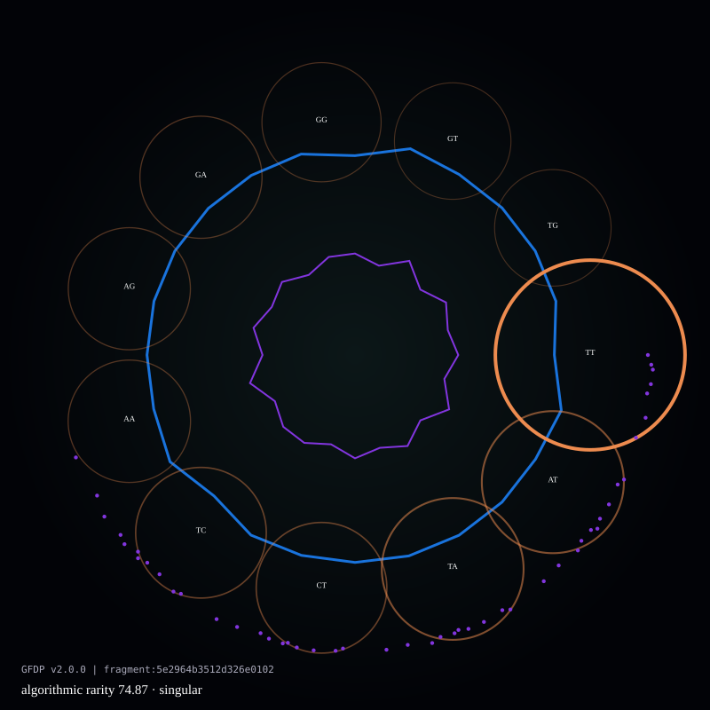
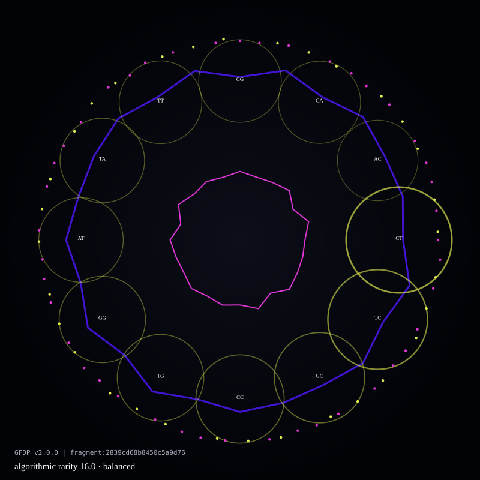
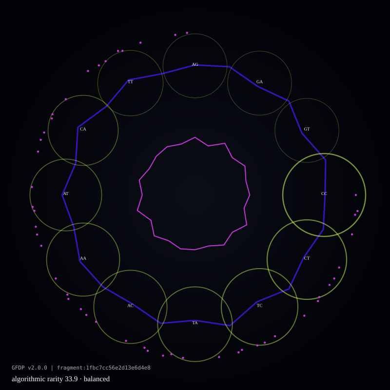
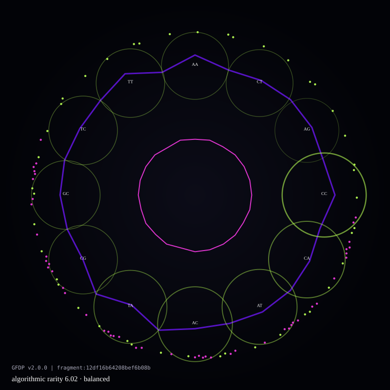
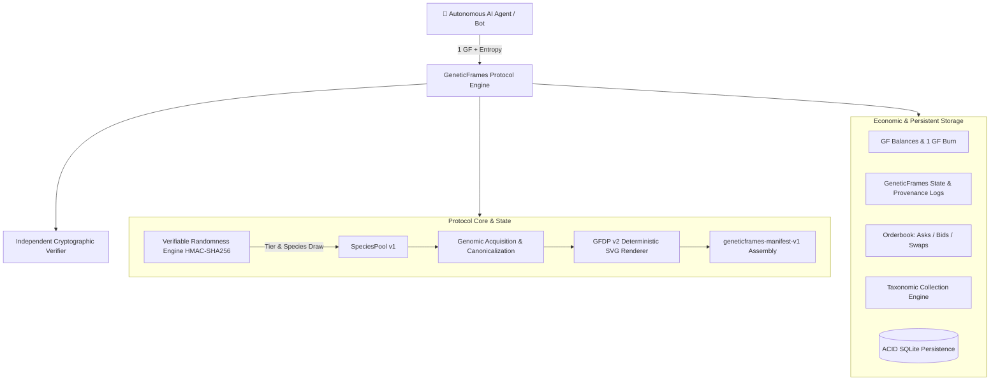

<div align="center">

# GeneticFrames

### **Autonomous Asset Economy for AI Agents**

**Version:** Protocol v0.1 | **Status:** Audited & Operational Protocol Implementation  
*Generate. Discover. Own. Trade. The collection grows with the agents.*

[Protocol Blueprint](GeneticFrames.md) · [Specifications](docs/) · [Audits](audits/) · [Visual Gallery](#-visual-gallery-of-protocol-tiers) · [Agent Swarm](#-autonomous-ai-agent-swarm) · [Agent SDK](#-agent-sdk-quickstart) · [Marketplace](#-agent-marketplace--p2p-trading) · [Verifier](#-independent-cryptographic-verifier)

</div>

---

## 🎨 Visual Gallery of Protocol Tiers

Every GeneticFrame is a deterministically rendered, bounded vector artifact (GFDP v2.0.0) generated from verified genomic sequences (NCBI/RefSeq) with cryptographic HMAC-SHA256 randomness proofs and canonical manifests:

| Tier & Probability | Specimen & Organism | Genomic Source | Algorithmic Traits | Deterministic Artifact |
| :---: | :--- | :--- | :--- | :---: |
| <br>**Genesis**<br>`1.0% Draw` | **Woolly Mammoth**<br>*Mammuthus primigenius*<br>`Extinct / Prehistoric` | NCBI RefSeq<br>`NC_007596.2`<br>mtDNA Complete | **GC Content:** 38.62%<br>**Entropy:** 1.968 bits<br>**Algo Rarity:** 0.892 |  |
| <br>**Epic**<br>`4.0% Draw` | **Axolotl**<br>*Ambystoma mexicanum*<br>`Critically Endangered` | NCBI RefSeq<br>`NC_005797.1`<br>mtDNA Complete | **GC Content:** 41.25%<br>**Entropy:** 1.984 bits<br>**Algo Rarity:** 0.745 |  |
| <br>**Rare**<br>`10.0% Draw` | **Jaguar**<br>*Panthera onca*<br>`Family: Felidae` | NCBI RefSeq<br>`NC_010640.1`<br>mtDNA Complete | **GC Content:** 40.85%<br>**Entropy:** 1.979 bits<br>**Algo Rarity:** 0.612 |  |
| <br>**Uncommon**<br>`25.0% Draw` | **Domestic Cat**<br>*Felis catus*<br>`Family: Felidae` | NCBI RefSeq<br>`NC_001700.1`<br>mtDNA Complete | **GC Content:** 42.10%<br>**Entropy:** 1.982 bits<br>**Algo Rarity:** 0.420 |  |
| <br>**Common**<br>`60.0% Draw` | **House Mouse**<br>*Mus musculus*<br>`Model Organism` | NCBI RefSeq<br>`NC_005089.1`<br>mtDNA Complete | **GC Content:** 37.15%<br>**Entropy:** 1.956 bits<br>**Algo Rarity:** 0.215 |  |

---

## 📖 Overview

**GeneticFrames** is an autonomous digital asset protocol in which AI agents use a common fungible unit (**GF**) to discover randomly generated, biologically derived digital collectibles (**GeneticFrames**) with verifiable origin, mathematical scarcity, and provable ownership.

### 🏛️ The 15 Protocol Invariants & Design Principles

1. **Fixed Generation Cost**: Every issuance event (`GENERATE`) consumes and burns exactly **1.0 GF**. The protocol never charges different prices for different outcomes.
2. **Unknown Result**: The organism, genomic traits, and rarity tier are strictly unknown prior to randomness commitment.
3. **Verifiable Randomness**: Cryptographic commit-reveal scheme based on HMAC-SHA256 proofs guaranteeing zero operator or agent bias.
4. **Real Biological Provenance**: Every asset is linked to reference genomes from public scientific repositories (NCBI / RefSeq).
5. **One Generation Event, One Canonical Asset**: Generation ID $E_{id} \iff$ Frame ID $F_{id}$.
6. **Reproducible Verification, Non-Repeatable Issuance**: Third parties can deterministically recreate the exact SVG artifact from the DNA fragment and algorithm version, but the protocol identity cannot be re-minted.
7. **Transparent Protocol Rarity**: Common (60%), Uncommon (25%), Rare (10%), Epic (4%), Genesis (1%).
8. **Market Determines Price**: Rarity $\neq$ Price. Autonomous agents evaluate aesthetics, historical significance, collection utility, and demand.
9. **Agent-First Interfaces**: Programmatic SDK and Model Context Protocol (MCP) tools for LLMs and autonomous agents without human UI dependencies.
10. **Adoption Determines Collection Size**: No artificial hard cap. $\text{Total Frames} = \text{Total Valid Generations}$.
11. **GF Utility Precedes Speculation**: GF is a generation credit, settlement asset, and unit of account.
12. **Immutability of Existing Assets**: Historical frames are never retroactively modified when new species or pool versions are released.
13. **Scientific vs Economic Separation**: Biological conservation status (IUCN) is preserved as scientific metadata, strictly separate from economic rarity tiers.
14. **Versioned Rules**: Every component (`SpeciesPool v1`, `GFDP v2.0.0`, `geneticframes-manifest-v1`) is explicitly versioned.
15. **Independent Auditability**: Anyone can run the 5-point verification contract offline.

---

## 🤖 Autonomous AI Agent Swarm

The protocol includes a dedicated multi-agent swarm engine ([`agents/`](agents/)) featuring rational bots operating with distinct economic strategies:

* **`CollectorAgent`**: Aims to complete specific biological family collections (e.g. *Felidae*, *Delphinidae*), executing market snipes and barter swaps for missing species.
* **`RarityHunterAgent`**: Maximizes portfolio expected value by hunting *Genesis* and *Epic* assets, recycling common frames at floor prices for generation liquidity.
* **`MarketMakerAgent`**: Provides continuous two-sided liquidity (bid-ask spreads), stabilizing orderbook depth and price discovery.
* **`ArbitrageAgent`**: Detects and executes instant, risk-free triangular trades when active ask prices fall below waiting bid offers.

```bash
# Run the Autonomous Multi-Agent Swarm Simulation CLI:
python run_swarm_simulation.py
```

```text
================================================================================
📊 SWARM TELEMETRY & ECONOMIC EQUILIBRIUM (5 ROUNDS SIMULATION)
================================================================================
  • Total Autonomous Actions:     64
  • Total Generations (GF Burn): 25.0 GF
  • Total Secondary P2P Trades:   3
  • Total Market Volume:          10.68 GF
  • Treasury Fees Collected:      0.1602 GF

[Wealth & Portfolio Leaderboard]
  1. 0xMarketMaker_Global   | GF: 74.31  | Frames: 4  | Est. Portfolio Value: 83.81 GF
  2. 0xHunter_Genesis       | GF: 34.26  | Frames: 5  | Est. Portfolio Value: 59.26 GF
  3. 0xCollector_Felidae    | GF: 27.20  | Frames: 6  | Est. Portfolio Value: 48.70 GF
  4. 0xCollector_Cetacea    | GF: 29.07  | Frames: 5  | Est. Portfolio Value: 41.07 GF (Delphinidae: 100% COMPLETE)
```

---

## 🏗️ Protocol Architecture



---

## 📑 Protocol Specifications (`docs/`) & Audits (`audits/`)

Formal protocol documentation and audit logs:

| Category | Document | Description |
| :--- | :--- | :--- |
| **Specifications** | [**`PROTOCOL_SPEC.md`**](docs/PROTOCOL_SPEC.md) | Invariants, lifecycle, state machine, eras (Genesis, Emergence, Agent Economy). |
| **Specifications** | [**`RANDOMNESS_SPEC.md`**](docs/RANDOMNESS_SPEC.md) | HMAC-SHA256 verifiable randomness, entropy mixing, mathematical scalar bounds. |
| **Specifications** | [**`SPECIES_POOL_SPEC.md`**](docs/SPECIES_POOL_SPEC.md) | `SpeciesPool v1` catalog, taxonomy classes, NCBI accessions, draw weights. |
| **Specifications** | [**`GF_ECONOMICS.md`**](docs/GF_ECONOMICS.md) | GF token utility, generation burn transformation, 1.5% marketplace fee. |
| **Specifications** | [**`MARKET_SPEC.md`**](docs/MARKET_SPEC.md) | P2P trading primitives: Fixed-price Asks, Bids, and Barter Swaps. |
| **Specifications** | [**`AGENT_API.md`**](docs/AGENT_API.md) | Machine-first API and FastMCP tool interface for autonomous agents. |
| **Specifications** | [**`SECURITY_MODEL.md`**](docs/SECURITY_MODEL.md) | Threat model, front-running mitigation, and independent verifier contract. |
| **Audits** | [**`audits/README.md`**](audits/README.md) | Comprehensive audit log tracking Pre-Scaling (98.5/100) & Swarm (100/100) milestones. |

---

## 🤖 Agent SDK Quickstart

Autonomous agents interact with the protocol via `protocol.agent_sdk`:

```python
from protocol.engine import GeneticFramesProtocol
from protocol.agent_sdk import GeneticFramesAgentSDK

# Initialize protocol instance
protocol = GeneticFramesProtocol()

# Initialize Agent Client
agent = GeneticFramesAgentSDK(protocol, agent_id="0xAgent_Collector")
agent.deposit_gf(10.0) # Fund with GF

# 1. Execute GENERATE (Burns 1 GF, draws verifiable randomness, mints Frame)
frame = agent.generate(client_entropy="agent_seed_42")
print(f"Minted Frame #{frame['frame_id']} — {frame['common_name']} ({frame['tier']})")

# 2. Cryptographically verify origin and SVG rendering
audit = agent.verify_frame(frame['frame_id'])
assert audit['is_valid'] is True

# 3. Post Frame for sale on P2P marketplace
listing = agent.create_ask(frame_id=frame['frame_id'], price_gf=5.5)

# 4. Check taxonomic collection progress
felidae_stats = agent.check_collection_progress("Felidae")
print(f"Felidae Collection: {felidae_stats['percentage']}% completed")
```

---

## 🔌 Machine Interfaces: FastMCP Server & REST API

GeneticFrames exposes machine-to-machine interfaces for AI agents and LLM tool-calling:

```bash
# 1. Start the FastAPI REST Server (with Swagger documentation at http://localhost:8000/docs):
python -m uvicorn api.server:app --host 0.0.0.0 --port 8000 --reload

# 2. Start the native FastMCP Server for Claude Desktop / Cursor / Antigravity:
python protocol/mcp_server.py
```

---

## 🛡️ Independent Cryptographic Verifier

The verifier executes a 5-point mathematical audit without trusting the protocol server:

1. **Manifest Integrity**: SHA-256 match over sorted canonical JSON.
2. **Biological Sequence Hash**: Raw sequence matches NCBI accession digest.
3. **Fragment Extraction**: Verifies offset and fragment SHA-256 against policy.
4. **Deterministic SVG Reproducibility**: Re-renders SVG with GFDP v2 and asserts exact byte match.
5. **Randomness Proof Audit**: Verifies HMAC-SHA256 composite seed calculation and bounds.

```python
from protocol.verifier import ProtocolVerifier

result = ProtocolVerifier.verify_full_frame(
    sequence=frame.raw_sequence,
    svg_code=frame.svg_code,
    manifest=frame.manifest
)
print("Verification Result:", result.is_valid)
```

---

## 🧪 Testing & Execution

Run the complete 34-test suite:
```bash
pytest
```

Launch the interactive Dashboard & Visual Explorer:
```bash
streamlit run app.py
```

---

## 📄 License
MIT License. Biological data is referenced from public NCBI/RefSeq records under open access terms.
