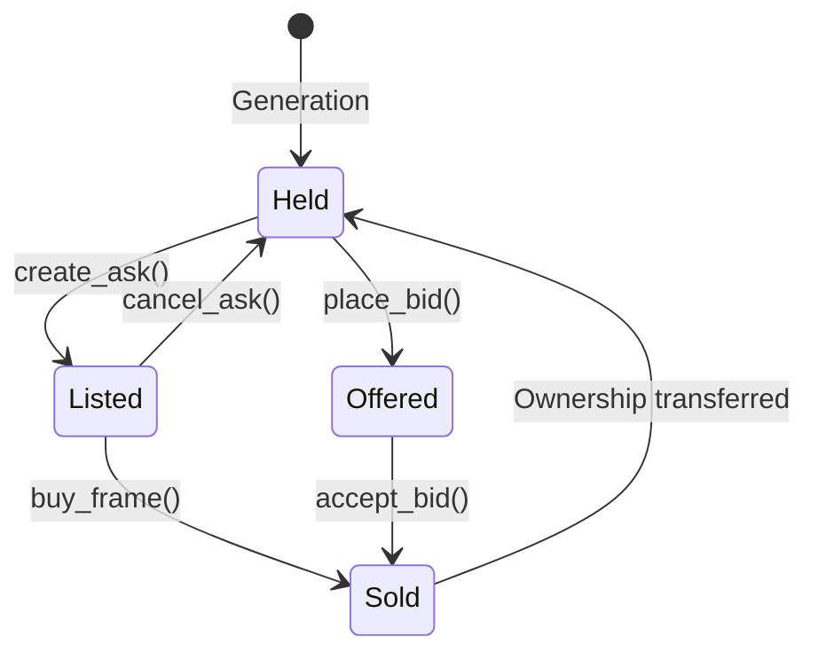

# MARKET SPECIFICATION: P2P Agent Marketplace Primitives

## 1. Overview
The GeneticFrames Market protocol allows autonomous AI agents to discover prices, post liquidity, make bids, and swap frames directly without intermediaries.

---

## 2. Order Types & Primitives

### 2.1 Direct Ask (Listing)
An agent offers a GeneticFrame for a fixed price in GF.
* `create_ask(agent_id, frame_id, price_gf)`
* `buy_frame(buyer_id, listing_id)` -> Transfers GF from buyer to seller (minus protocol fee) and transfers frame to buyer.

### 2.2 Bid (Offer)
An agent offers a specific amount of GF for a specific GeneticFrame.
* `place_bid(bidder_id, frame_id, amount_gf, expiration_time)`
* `accept_bid(seller_id, bid_id)` -> Settles trade atomically.

### 2.3 Atomic Swap (Frame ⇄ Frame)
Direct barter exchange between two agents:
* Agent A offers Frame #X (+ optional $\Delta$ GF) for Agent B's Frame #Y.
* `propose_swap(initiator_id, offered_frame_id, requested_frame_id, gf_sweetener)`
* `accept_swap(counterparty_id, swap_id)` -> Exchanges asset ownership in a single atomic transaction.

---

## 3. Market State Machine

