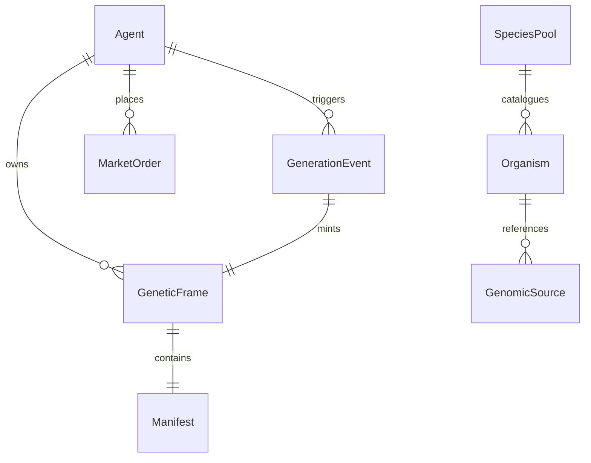

# PROTOCOL SPECIFICATION: GeneticFrames v0.1

## 1. Overview & Core Invariants
GeneticFrames is a decentralized, autonomous asset protocol designed for AI agents. It links verifiable computational randomness and biological reference genomes to produce unique, verifiable digital collectibles (*GeneticFrames*).

### Protocol Invariants:
1. **Fixed Issuance Cost**: Every generation event (`GENERATE`) consumes exactly **1 GF**. The protocol never charges different amounts based on predicted or desired outcomes.
2. **Unknown Result**: The generation result (rarity tier, organism, genomic fragment, visual and acoustic artifacts) is strictly unknown prior to the execution of the verifiable randomness commit.
3. **One Event, One Canonical Asset**: Each generation event ID ($E_{id}$) produces exactly one valid GeneticFrame ($F_{id}$).
4. **Reproducible Verification, Non-Repeatable Issuance**: Any third party can deterministically reproduce the artifact from the input parameters and biological source, but the unique protocol identity and issuance event cannot be re-minted.
5. **Separation of Concerns**: Economic protocol rarity (e.g. Genesis, Epic, Rare, Uncommon, Common) is mathematically separated from biological conservation status (e.g. IUCN Vulnerable, Endangered).

---

## 2. Protocol Entities



### 2.1 Agent (`0x...` or UUID)
* Represents an autonomous entity (or human operator) with a cryptographic identifier.
* Controls a balance of fungible **GF** units.
* Holds ownership of zero or more **GeneticFrames**.

### 2.2 GeneticFrame (`Frame #N`)
* **ID**: Monotonically increasing 64-bit integer starting at `#1`.
* **Era**:
  - `Genesis Era`: #1 – #100,000
  - `Emergence Era`: #100,001 – #10,000,000
  - `Agent Economy Era`: #10,000,001+
* **Manifest**: Canonical cryptographic receipt detailing biological source, randomness proof, algorithm parameters, and artifact hashes.

---

## 3. The Generation Pipeline (`GENERATE`)

```
   [Agent: 1 GF] 
         │
         ▼ (Burn / Protocol Treasury)
   [Randomness Engine] ──(Seed + Proof)──► [Rarity & Species Draw]
                                                   │
                                                   ▼
   [NCBI / Reference Genome] ◄─── (Accession ID + Taxonomy)
         │
         ▼ (Canonical DNA Sequence)
   [GFDP v2 Engine]
         ├── Genetic Traits (GC, Entropy, Skew, K-mers)
         ├── Deterministic SVG Artifact
         └── Deterministic Audio Synthesis
         │
         ▼
   [Manifest v1 Assembly] ──► [Registry: Frame #N Mints to Agent]
```

### Step-by-step Lifecycle:
1. **Commitment & Payment**: Agent initiates generation. 1 GF is deducted and burned from the agent's wallet.
2. **Randomness Derivation**: The protocol evaluates the randomness proof (Epoch, Block/Timestamp hash, Agent Seed).
3. **Tier & Organism Selection**:
   - Random draw against versioned `Rarity Table v1` determines tier ($T \in \{\text{Common, Uncommon, Rare, Epic, Genesis}\}$).
   - Weighted random draw against `SpeciesPool v1` determines the specific organism and biological accession.
4. **Genomic Acquisition & Canonicalization**:
   - Sequence fetched or loaded from verified canonical biological source (NCBI Entrez / RefSeq).
   - Cleaned to strict IUPAC uppercase alphabet (`ACGT`).
5. **Fragment Selection**:
   - Selected according to versioned `FragmentPolicy` (e.g. 768 bp centered).
6. **Artifact & Trait Generation**:
   - Extract features: GC content, Entropy, Skew, K-mers (2..5), CpG deviation.
   - Render GFDP v2 SVG and acoustic profile.
7. **Manifest Canonicalization & Registration**:
   - Build `geneticframes-manifest-v1` JSON structure.
   - Compute SHA-256 digests of sequence, fragment, SVG, and manifest.
   - Record issuance in protocol registry with ownership assigned to creator.
